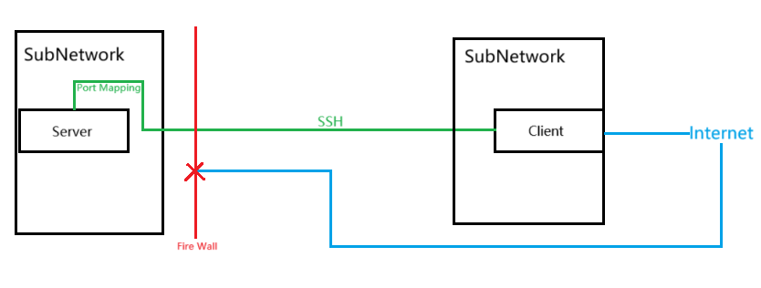

# Reverse-SOCKS5-proxy-through-SSH-tunnel
基于Python脚本开发的轻量级解决方案，能够快速搭建内网设备的网络代理服务。实现条件极为简单，只要目标设备具备SSH连接能力，即可创建稳定的网络访问链路。
  
### 适用场景
适用于所有服务器无法直接访问互联网，但开放了SSH端口供客户端连接的环境。在此配置下，客户端需具备互联网访问能力。下图展示了一个典型应用场景（实际网络环境可以比图示更加复杂，只要能够建立SSH连接即可实现功能）。

  
### 使用要求
1. 服务器需开放SSH端口以支持远程连接
2. 客户端需具备访问公网的能力
3. 两端系统均需安装Python环境（仅依赖标准库）
  
### 使用教程
1. 使用SSH建立端口转发（隧道）  
本地terminal执行：`ssh -L 127.0.0.1:L_Port1:内部服务器:R_Port1 user@网关服务器`  
效果：将本地`L_Port1`端口的流量通过SSH隧道转发到内网服务器的`R_Port1`端口  
其中：`127.0.0.1`代表本地网络，不需要修改；本地`L_Port1`端口为隧道监听的本地端口，需要与“5.”中的`L_Port1`相同，且不能与本地已有端口冲突；服务器的`R_Port1`端口为转发的目的地端口，需要与“2.”中的`R_Port1`相同，且不能与服务器已有端口冲突  
  
3. 服务器运行[Tunnel_server.py](./Tunnel_server.py)  
运行前先配置脚本中的`local_port=R_Port2, tunnel_host='0.0.0.0', tunnel_port=R_Port1`三个参数  
其中：`0.0.0.0`表示全局网络，不需要修改；`R_Port2`为服务器端用来监听应用请求的伪socks5端口，需要与“5.”中的`R_Port2`相同，且不能与服务器已有端口冲突  
  
4. 客户端运行[pysoxy.py](./pysoxy.py)  
pysoxy.py在客户端启动了一个轻量的socks5服务，运行前先配置`LOCAL_PORT = L_Port2`参数  
其中：`L_Port2`为socks5服务在客户端用来监听请求的端口，需要与“5.”中的`L_Port2`相同，且不能与本地已有端口冲突
  
5. 客户端运行[Tunnel_client.py](./Tunnel_client.py)  
运行前先配置`tunnel_host = '127.0.0.1', tunnel_port = L_Port1, socks5_port = L_Port2`三个参数  

6. 服务器（Linux）使用Internet
- apt服务需要借助proxychains软件实现socks5代理：`sudo proxychains apt install <package-name>`  
使用proxychains软件需要先修改配置文件：① bash执行 `sudo nano /etc/proxychains.conf`， ② 添加一行 `socks5  127.0.0.1 R_Port2`  
- pip服务需要加上socks5代理命令：`pip install --proxy socks5h://127.0.0.1:R_Port2 numpy`  
  
### Test example
`sudo proxychains apt install <package-name>`  
`pip install --proxy socks5h://127.0.0.1:9000 numpy`  
`curl -v --proxy socks5h://127.0.0.1:9000 https://www.baidu.com`
